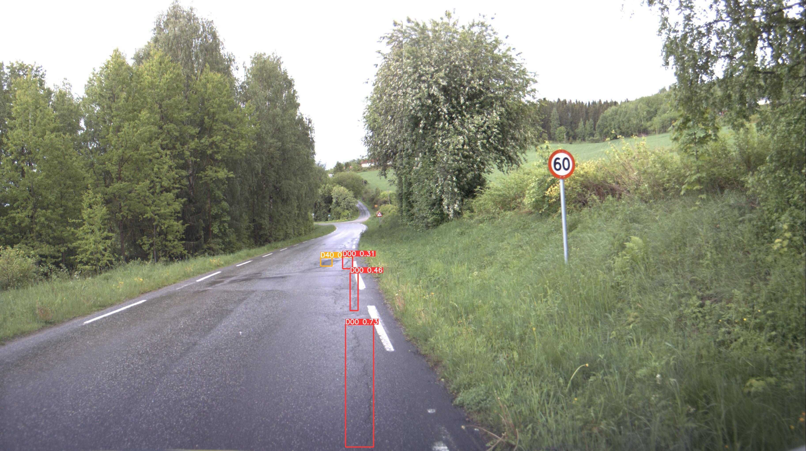

# TDT17 Mini Project
This is the final project for TDT17. For this task we are going to detect Road damage detection. This repositry consist of the results and overall models used for the detection.


## Folder Structure
* `data/` - Contains the data files
* `src/` - Contains the source code for the pre-processing
* `notebooks/` - Contains the notebooks for the analysis
* `yolov5s` - Contains the YOLOv5 model from [Ultralytics](https://github.com/ultralytics/yolov5) 
* `yolov5s/runs/train/` - Contains the training results for every country in the following order Czech (exp), China_Drone(exp2), China_Motorbike(exp3), India (exp4), Japan (exp5), United States (exp6) and Norway (exp7).
* `yolov5m` - Contains one increased size of model from YOLOv5s

## Dataset
The dataset is given from [github](https://github.com/sekilab/RoadDamageDetector) with the [paper](https://www.researchgate.net/publication/363668453_RDD2022_A_multi-national_image_dataset_for_automatic_Road_Damage_Detection) providing a detailed information about the dataset. The dataset used is the Road Damage Dataset 2022, RDD2022. This dataset comrpises of 47,420 road images from six different countries. The classes we are interested in deteting is the following:

* Longitudinal Cracks (D00)
* Lateral Cracks (D10)
* Alligator Cracks (D20)
* Putholes (D40)


## Method
YOLOv5 is used for the object detection. The model is trained on the RDD2022 dataset. The model is trained on classes mentioned above. The model is trained on 80% of the training dataset and tested on the remaining 20% of training data. The model is trained on cluster computer IDUN at NTNU with GPU enabled. The final result of model did not use the last dataset from Norwegian dataset `yolov5s/runs/train/exp7` as the model performance became worse. The final model can therefore be found in `yolov5s/runs/train/exp6`. The best weights from each country saved in the different runs. The final model was trained with following slurm commands on IDUN:


```bash
#!/bin/sh
#SBATCH --partition=GPUQ
#SBATCH --account=ie-idi
#SBATCH --nodes=2
#SBATCH --ntasks-per-node=1
#SBATCH --mem=64000
#SBATCH --job-name="yolov5_final"
#SBATCH --gres=gpu:V10032:2
#SBATCH --mail-user=salara@stud.ntnu.no
#SBATCH --mail-type=ALL
#SBATCH --time=00-00:00:00    # Upper time limit for the job (DD-HH:MM:SS)
#SBATCH --output=yolov5s.out

# Enter Directory
WORKDIR=${SLURM_SUBMIT_DIR}
cd ${WORKDIR}
cd yolov5s

# Load module
module load Python/3.8.6-GCCcore-10.2.0

# INstall requirements
pip install -r requirements.txt


## Czech (exp)
python3 train.py --image-weights --img 600 --batch 16 --epochs 50 --data czech.yaml --weights yolov5s.pt --device 0,1

## China_Drone (exp2)
python3 train.py --image-weights --img 512 --batch 16 --epochs 50 --data china_drone.yaml --weights /cluster/work/salara/TDT17/yolov5s/runs/train/exp/weights/best.pt 

## China_MotorBike (exp3)
python3 train.py --image-weights --img 512 --batch 16 --epochs 50 --data china_motorbike.yaml --weights /cluster/work/salara/TDT17/yolov5s/runs/train/exp2/weights/best.pt 

## India (exp4)
python3 train.py --image-weights --img 720 --batch 16 --epochs 100 --data india.yaml --weights /cluster/work/salara/TDT17/yolov5s/runs/train/exp3/weights/best.pt 

## Japan (exp5)
python3 train.py --image-weights --img 600 --batch 16 --epochs 100 --data japan.yaml --weights /cluster/work/salara/TDT17/yolov5s/runs/train/exp4/weights/best.pt

## United States (exp6)
python3 train.py --image-weights --img 640 --batch 16 --epochs 50 --data united_states.yaml --weights /cluster/work/salara/TDT17/yolov5s/runs/train/exp5/weights/best.pt 

## Norway (exp7)
python3 train.py --image-weights --img 1000 --batch 16 --epochs 50 --data norway.yaml --weights /cluster/work/salara/TDT17/yolov5s/runs/train/exp6/weights/best.pt


./yolov5s.out

```

## Results





## Extra
Since I was not completely happy with results I tried to increase the size of YOLOv5 model to YOLOv5m. The results were very similar to the other model but can be found in not as good as YOLOv5s. The results can be found in `yolov5m`.


